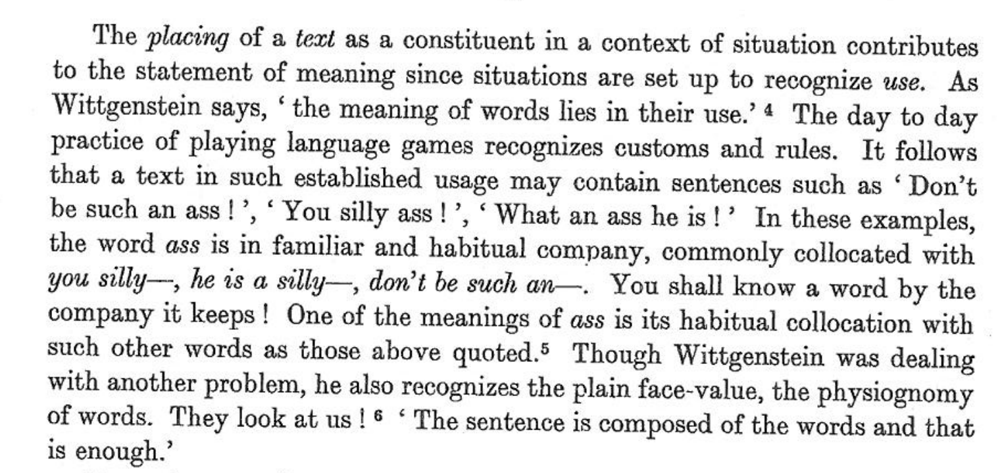

## Learning from biased data

In terms of decision making, a [well-cited definition of fairness is](https://arxiv.org/pdf/1908.09635.pdf) "the absence of any prejudice or favoritism towards an individual or a group based on their inherent or acquired characteristics".

We live in a world full of bias. Opportunities such as education and healthcare are not evenly distributed: access is largely a matter of luck and a reflection of our circumstances of birth.

Given the uneven, biased world we live in, it is hardly surprising that the machine learning models that we build are highly susceptible to exhibiting prejudice and favoritism.

## Language models

Natural Language Processing (NLP) is an area of machine learning focused on the analysis of text. NLP has numerous practical applications, including voice recognition, foreign-language translation, and even [AI pair programming](https://copilot.github.com/).

In recent years, some of the major advances in NLP have been in the evolution of models that allow tokens (words, characters) in text sequences to be predicted from their context. Two such models include Bidirectional Encoder Representations from Transformers (BERT) and Generative Pre-trained Transformer (GPT).

These language models are built upon "word embeddings", which are representations of words in a multi-dimensional space. The models implement a concept popularized by linguist John Firth that "a word is characterized by the company it keeps".

{: width="600px"}

While on a surface level modern language models can give the appearance of possessing human-like intelligence - for example, by holding conversations or by creating poems - they are doing nothing more than parroting the language structures they have been trained upon.

When the models are trained on biased data - which they inevitably are - the models become amplifiers of often harmful sterotypes. This issue - and a proposed approach to their mitigation - are discussed by Bolukbasi et al in [Man is to Computer Programmer as Woman is to
Homemaker? Debiasing Word Embeddings](https://arxiv.org/pdf/1607.06520.pdf).

In their paper [On the Dangers of Stochastic Parrots](https://dl.acm.org/doi/pdf/10.1145/3442188.3445922), Bender et al further explore the risks of such language models.

<!--  
Task: read section X and answer questions.
-->

