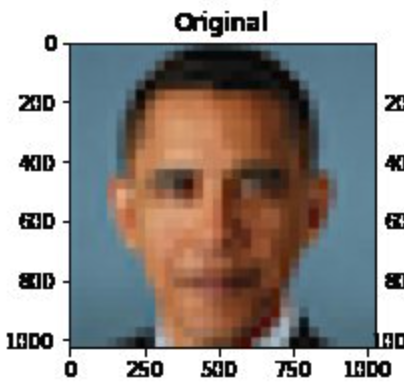
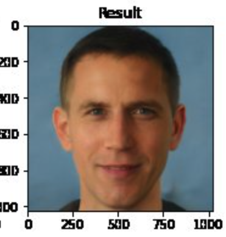

## Bias and fairness

<!--

See: https://www.nature.com/articles/s41746-021-00549-7 Box 2 on algorithmic bias.
-->

We live in a world full of bias. Opportunities such as education and healthcare are not evenly distributed: access is largely a matter of luck and a reflection of our circumstances of birth. Given the uneven, biased world we live in, it is hardly surprising that the machine learning models that we build are highly susceptible to exhibiting favoritism and prejudice.

Bias is a systematic preference or prejudice against a particular group, individual, or feature. A [well-cited definition of fairness is](https://arxiv.org/pdf/1908.09635.pdf) "the absence of any prejudice or favoritism towards an individual or a group based on their inherent or acquired characteristics". 

Machine learning models are increasingly used in ways that directly affect people's lives, so it is crucially important that we strive for fairness to prevent harmful discrimination. 

Strategies to achieve fairness often focus on attempting to eliminate bias in training data (for example, by collecting more representative datasets) or by making algorithmic adjustments (for example, by weighting underrepresented classes more heavily). This remains an active research area, wth no simple solutions. 

## Language models

Natural Language Processing (NLP) is an area of machine learning focused on the analysis of text. NLP has numerous practical applications, including voice recognition, foreign-language translation, and even [AI pair programming](https://copilot.github.com/).

In recent years, some of the major advances in NLP have been in the evolution of models that allow tokens (words, characters) in text sequences to be predicted from their context. Two such models include Bidirectional Encoder Representations from Transformers (BERT) and Generative Pre-trained Transformer (GPT).

These language models are built upon "word embeddings", which are representations of words in a multi-dimensional space. The models implement a concept popularized by linguist John Firth that "a word is characterized by the company it keeps".

When the models are trained on biased data - which they inevitably are - the models become amplifiers of often harmful sterotypes. This issue, and a proposed approach to their mitigation, are discussed by Bolukbasi et al in [Man is to Computer Programmer as Woman is to Homemaker? Debiasing Word Embeddings](https://arxiv.org/pdf/1607.06520.pdf).

> The blind application of machine learning runs the risk of amplifying biases present in data. Such a danger is facing us with word embedding, a popular framework to represent text data as vectors which has been used in many machine learning and natural language processing tasks. We show that even word embeddings trained on Google News articles exhibit female/male gender stereotypes to a disturbing extent.
> 
> ...
> 
> given an analogy puzzle, “man is to king as woman is to x” (denoted as man:king :: woman:x), simple arithmetic of the embedding vectors finds that x=queen is the best answer because:
> 
> 
> $$
> \overrightarrow{man} - \overrightarrow{woman} \approx \overrightarrow{king} − \overrightarrow{queen}
> $$
> 
> 
> ...
> 
> ... the same system that solved the above reasonable analogies will offensively answer “man is to computer programmer as woman is to x” with x=homemaker. Similarly, it outputs that a father is to a doctor as a mother is to a nurse. 

## Stochastic parrots 🦜

On a surface level modern language models can give the appearance of possessing human-like intelligence, for example, by holding conversations or by creating poems.

In their paper [On the Dangers of Stochastic Parrots: Can Language Models Be Too Big? 🦜](https://dl.acm.org/doi/pdf/10.1145/3442188.3445922), Bender et al ask: "What are the possible risks associated with this technology and what paths are available for mitigating those risks?". 

The abstract is copied below:

> The past 3 years of work in NLP have been characterized by the development and deployment of ever larger language models, especially for English. BERT, its variants, GPT-2/3, and others, most recently Switch-C, have pushed the boundaries of the possible both through architectural innovations and through sheer size. Using these pretrained models and the methodology of fine-tuning them for specific tasks, researchers have extended the state of the art on a wide array of tasks as measured by leaderboards on specific benchmarks for English. In this paper, we take a step back and ask: How big is too big? What are the possible risks associated with this technology and what paths are available for mitigating those risks? We provide recommendations including weighing the environmental and financial costs first, investing resources into curating and carefully documenting datasets rather than ingesting everything on the web, carrying out pre-development exercises evaluating how the planned approach fits into research and development goals and supports stakeholder values, and encouraging research directions beyond ever larger language models.

In summarizing paths forward for research, they suggest:

> In summary, we advocate for research that centers the people who stand to be adversely affected by the resulting technology, with a broad view on the possible ways that technology can affect people. This, in turn, means making time in the research process for considering environmental impacts, for doing careful data curation and documentation, for engaging with stakeholders early in the design process, for exploring multiple possible paths towards longterm goals, for keeping alert to dual-use scenarios, and finally for allocating research effort to harm mitigation in such cases.

## Photo upsampling

Similar biases can be seen in image models. In [their paper](https://arxiv.org/pdf/2003.03808.pdf) on "PULSE: Self-Supervised Photo Upsampling via Latent Space Exploration of Generative Models", Menon and colleagues describe the application of a machine learning algorithm for upsampling images. 

The paper demonstrates how a blurry, low resolution image can be transformed into a "sharp, realistic, high-resolution image". Soon after publication, apparent biases were [shared widely on social media](https://twitter.com/Chicken3gg/status/1274314622447820801?s=20&t=_oORPJBJRaBW_J0zresFJQ).

> ## Question
> A) Who is shown in this blurred picture? 
> 
> > ## Answer
> > A) While the picture is of Barack Obama, the upsampled image shows a white face. 
> {: .solution}
{: .challenge}

Menon and colleagues subsequently updated their paper to discuss this issue of bias. They assert that the problems inherent in the PULSE model are largely a result of the [underlying StyleGAN model](https://arxiv.org/abs/1812.04948), which they had used in their work. 

> Overall, it seems that sampling from StyleGAN yields white faces much more frequently than faces of people of color ... This bias extends to any downstream application of StyleGAN, including the implementation of PULSE using StyleGAN.
> 
> ...
> 
> Results indicate a racial bias among the generated pictures, with close to three-fourths (72.6%) of the pictures representing White people. Asian (13.8%) and Black (10.1%) are considerably less frequent, while Indians represent only a minor fraction of the pictures (3.4%).

You can [try the model here](https://colab.research.google.com/github/tg-bomze/Face-Depixelizer/blob/master/Face_Depixelizer_Eng.ipynb#scrollTo=fU0aGtD4Nl4W).

<!--

# Biased labels

TODO:

Jury learning: https://arxiv.org/abs/2202.02950

-->

