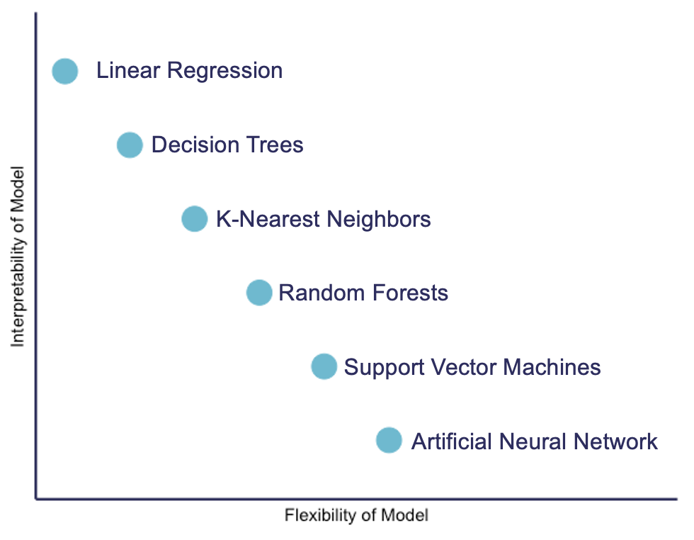

## Interpretability and explainability

"Interpretable" and "explainable" are terms that are often used interchangeably to describe the characteristic of a machine learning model to be understood. In recent literature, however, interpretable is perhaps more often used to refer to models with limited complexity and predictable behaviour. For example, we've seen decision trees be inherently interpretable:

But when we looked at convolutional neural networks it was much harder to understand what was happening "under the hood".

If we can look at our model and predict what will happen to our prediction if input values change, then we can say that the model is interpretable. Often, however, data and models are too complex and high-dimensional to be easily understood. They cannot be explained by a simple relationship between inputs and outputs.

So why use complex models? Well as we have seen, complex models tend to perform better, particularly on more difficult tasks. This is because the complexity of the undlerying model allows it to adapt to more complex problems, in other words these complex models are more flexible. When choosing a model we have to try and find the right balance between interpretablilty and flexibility depending on what we are going to use it for.

Interpretability is not the only reason you may want to pick a less flexible model. These more complex models take longer and are harder to train, on top of this they will sometimes try and find more complicated relationships than the ones that actually exist in the data.

There is still a focus on attempting to dissect the decision making procedure of these more complex models. These insights lead us to explainability: our ability to gaze into a complex model and explain its behaviour.

## The necessity of interpretability and explainability

If a model is making a prediction, many of us would like to know how the decision was reached. With this understanding, we gain trust. [Doshi-Velez and Kim](https://arxiv.org/pdf/1702.08608.pdf) suggest that interpretablity (/explainablity) can assist in ascertaining presence of desired features such as fairness, privacy, reliability, robustness, causality, usability and trust:

- Fairness: that groups are not discriminated against. 
- Privacy: that sensitive information is not revealed. 
- Reliability and robustness: that models reach certain levels of performance despite parameter or input variation. 
- Causality: that predicted changes in output due to a perturbation will occur as expected. 
- Usability: that methods provide information that assist users to accomplish a task.

In machine learning in health, it has been argued that explainable AI is necessary to gain trust with the health-care workforce, provide transparency into decision making processes, and to mitigate bias. As a counterpoint, [Ghassemi and colleagues](https://doi.org/10.1016/S2589-7500(21)00208-9) argue that urrent explainability methods are unlikely to achieve these goals for patient-level decision support.

Instead, they advocate for "rigorous internal and external validation of AI models as a more direct means of achieving the goals often associated with explainability", and "caution against having explainability be a requirement for clinically deployed models".

## Saliency maps

Saliency maps - and related approaches - are popular form of explainability for imaging models. Saliency maps use color to illustrate the extent to which a region of an image contributes to a given decision. For example, when building neural network models to predict lung conditions (pleural effusion) we can see the model pays particular attention to certain areas of an image.

While saliency maps may be useful, they are also [known to be problematic](https://arxiv.org/abs/1810.03292) in many cases. Displaying a region of importance leaves us to decide what the explanation might be. The human tendency is to assume that the feature we would find important is the one that was used (this is an example of a famously harmful cognitive error called confirmation bias). 

This problem is well summarised by computer scientist Cynthia Rudin: “You could have many explanations for what a complex model is doing. Do you just pick the one you 'want’ to be correct? The ability of localisation methods to mislead human users is compellingly demonstrated by [Adebayo and colleagues](https://arxiv.org/abs/1810.03292), who show that even untrained networks can produce saliency maps that appear reassuring.

<!--  TODO:

## Shapley values

In "Stop Explaining Black Box Machine Learning Models for High Stakes Decisions and Use Interpretable Models Instead", Cynthia Rudin

These concerns also extend to other well known post-hoc explanation methods such as locally interpretable model-agnostic explanations (LIME)27 and Shapley values (SHAP).28 LIME seeks to understand decisions at the individual level by permuting the input example (altering it in minor ways) and identifying which alterations were most likely to change the decision. In the case of image analysis, this is done by occluding parts of the image, the explanation consisting of a heat map that indicates the image components that were most important for the decision. Such explanations suffer from interpretability gaps in the same way as saliency mapping. Methods such as LIME and SHAP are generic and not specific to images and are routinely used on a wide variety of health-care data, including structured data from electronic health-care records29 and electroencephalogram waveform data.30

-->

## Explainability of machine learning models

The requirement for explainability is even making its way into legal governance. The European Union General Data Protection (GDPR)) for example, states that "[the data subject should have] the right ... to obtain an explanation of the decision reached".

If our doctor or nurse recommends paracetamol (acetaminophen) for pain management, most of us would accept the suggestion without question. This is despite the action of paracetamol at a molecular level [being unclear](https://pubmed.ncbi.nlm.nih.gov/15662292/). Are we holding machine learning models to a higher standard than humans? 


