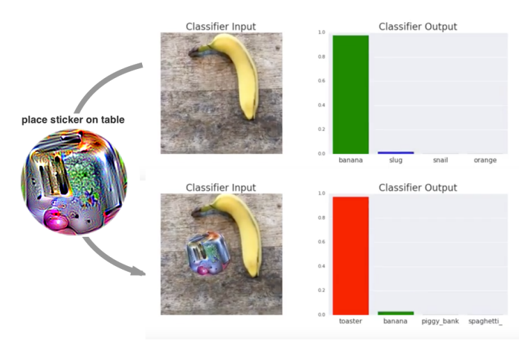
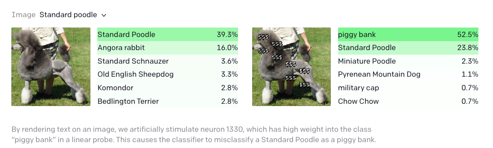
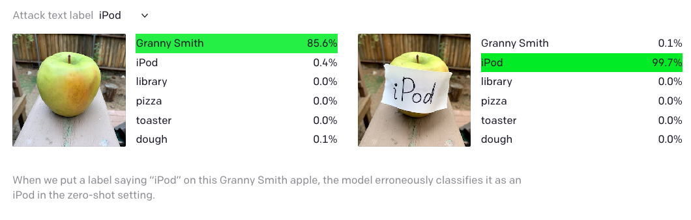

## Manipulation of models

It is important to be aware that models are susceptible to manipulation by targeted attacks. A model is susceptible to attack if it can be manipulated to produce an unexpected output. Currently most examples of models being mislead are theoretical - and often humourous - but this is likely to change as the stakes increase. These examples also demonstrate the fragility of models. It is not difficult to see how an algorithm-led system could reach an incorrect decision simply due to an unusual event.

## Adversarial attacks

One common method for attack is to alter input data to intentionally cause misclassification. Researchers at Google, for example, demonstrated that they could generate a sticker that could [trick a machine learning model](https://slate.com/technology/2018/01/google-researchers-tricked-an-a-i-into-thinking-a-banana-was-a-toaster.html) into confusing a picture of a banana with a toaster.

{: width="800px"}

While the "adversarial patch" requires significant effort to fool the algorithm, researchers at OpenAI discovered that their image classification model could be fooled by nothing more than a pen and paper. They announced that a model that they had developed for classifying images would "respond to the same concept whether presented literally, symbolically, or conceptually. As a result, they demonstrated some [surprising results](https://www.theguardian.com/technology/2021/mar/08/typographic-attack-pen-paper-fool-ai-thinking-apple-ipod-clip) in the application of the model.

{: width="800px"}

{: width="800px"}

## Adversarial attacks in tumour classification

Computational models are being used more and more for tasks with serious real world outcomes. One example of this is in computational pathology where deep learning models are used to look at tissue sections and classify wheter or not a section of tissue is cancerous. ['Now You See It, Now You Don't'](https://doi.org/10.48550/arXiv.2106.08153) is a paper dedicated to showing how adversarial attacks in one of these tissue classification models can cause a pertubation in an image that is not detectable to the human eye but wildly changes the prediction of a well trained model.

This figure shows the original and perturbed images along with how this affected the saliency maps and overall image classifications. The paper not only showed how individual images could be manipulated by specific pertubations, but also created a single pertubation that would have an adversarial effect on all of the images used by the model. They concluded: "Based on our analysis, we strongly recommend that computational pathology models be critically analyzed using the proposed adversarial validation strategy prior to clinical adoption".

<!--

Data can be overlaid with targeted values that lead to misclassification.

https://www.science.org/doi/10.1126/science.aaw4399

https://arxiv.org/abs/1804.05296

Examples, and discussion.

https://twitter.com/MIT_CSAIL/status/1507754751995260931

https://slate.com/technology/2018/01/google-researchers-tricked-an-a-i-into-thinking-a-banana-was-a-toaster.html

https://www.theguardian.com/technology/2021/mar/08/typographic-attack-pen-paper-fool-ai-thinking-apple-ipod-clip

https://kde.mitre.org/blog/2018/10/28/is-this-a-wolf-understanding-bias-in-machine-learning/

https://arxiv.org/abs/1804.05296

TODO:

Look at 4 in https://arxiv.org/pdf/2012.05345.pdf

## Data injection

TODO:

Where models are continuously trained, there is risk that new training data might be intentionally injected in order to achieve a desired outcome.

-->

